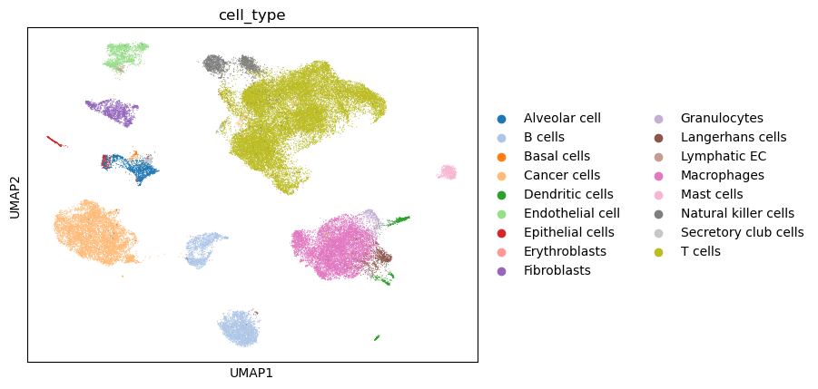
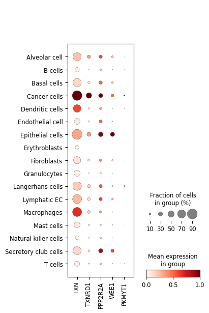

## E-MTAB-6149 Single Cell RNA-seq Workflow

**The dataset for this workflow can be found at the link below**

[Single Cell Dataset](https://figshare.com/articles/dataset/E-MTAB-6149/14308775)

**The first step for my analysis was to convert the RDS objects created in R by the researchers into python by utilizing the pyreadR python package. The files I downloaded from the dataset were the sparse gene expression matrix and the cell-type annotation file.**

**In my python script, I did a table join of the sparse expression matrix and the celltype annotation file, using the cell barcodes as the column to join on. This allowed me to add the already determined celltypes into the Annotation Data object. For the main part of my analysis, I utilized both scanpy and scvi-tools to run the single-cell RNA-seq workflow. Scvi allows for probablistic modeling of SC RNA-seq data, utilizing deep learning and variational auto-encoders to create a latent representation of the gene expression landscape. Once I had my trained model, I could then run Scanpy's nearest-neighbor algorithm and create UMAP figures based on the latent space (as opposed to using the traditional approach of PCA to reduce the dimensionality of the dataset). I also create dotplots to visualize the expression levels for any given gene of interest. Finally, I performed differential gene expression analysis using both scanpy's wilcoxon ranked-sum approach, as well as scVI's bayesian differential expression analysis. Both tests were conducted between the cells annotated as cancer cells, and each other individual immune cell type. The summary statistics from these tests were then outputted to csv's for easy view in programs like Excel.***


## Cell-types UMAP 



## UMAPs for Genes

```{python}
#| echo: false
#| results: asis

import os 
from IPython.display import Markdown, display
umap_dir = "../../results/junrang/gene_umaps"

files = sorted([file for file in os.listdir(umap_dir)])

for fname in files:
    gene = fname.replace("umap_", "").replace(".png", "")
    md = f"### {gene}\n\n"
    display(Markdown(md))

```


## Dotplot of Gene Expression across the cell-types 




## Summary statistics 

Scanpy's Wilcoxon Rank-Sum Test Between Cancer Cells and Each Other Immune Cell for the DNA Repair Genes:

For the vast majority of cases, each gene's expression in non-cancer immune cell-types is lower when compared to their expression in the cancer cell. In this Wilcoxon rank sum test (Scanpy has a built in function, rank_genes_groups to compute this), the cancer cells are the reference group. This means that negative log-fold changes represent a decreased expression in the test group (each non-cancer immune celltype), whereas a positive log-fold change would indicate the inverse. 

```{python}
import pandas as pd
pd.set_option("display.max_rows", None)
df = pd.read_csv("~/USF_Lung_Cancer/data/junrang/wilcoxon_degs.csv")
print(df.to_markdown(index = False))
```

