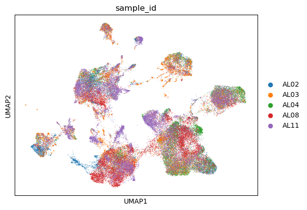
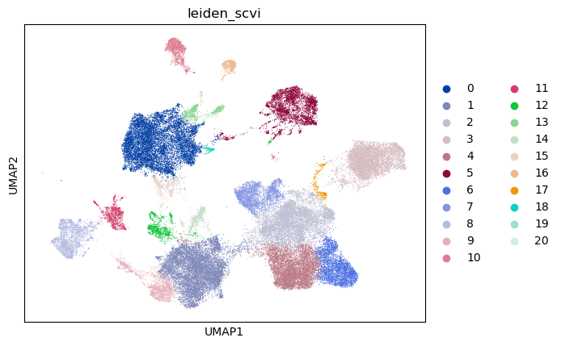
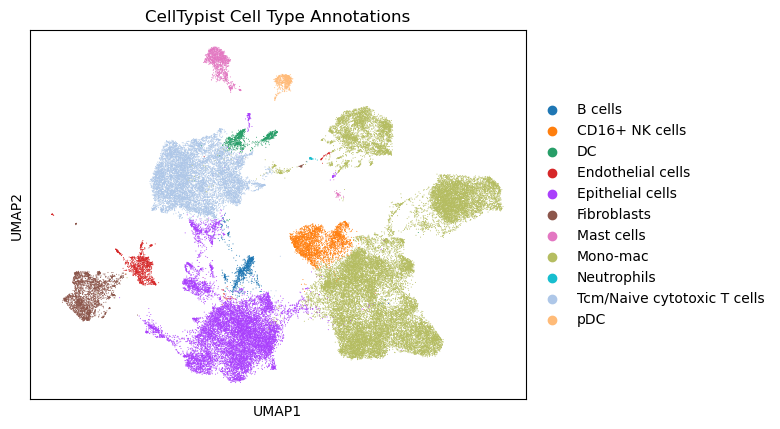
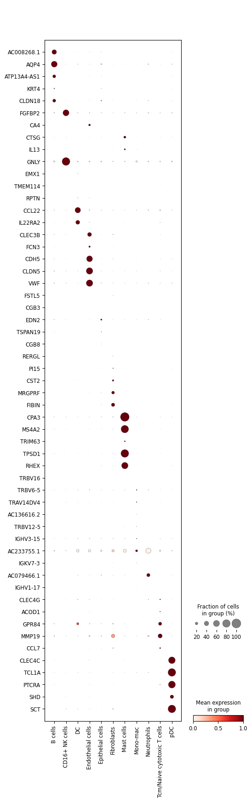

## Downloading Gene Expression Data
The first step in this analysis is to download the gene expression matrix files. For this analysis, we will be using only wild-type samples. I have consulted the supplementary material and subsequent supplementary figure 1 to find out which scRNA-seq samples are wild-type and which are ALK positive. The supplementary materials file can be downloaded in the Supporting information section [here](https://pmc.ncbi.nlm.nih.gov/articles/PMC11999889/)

Once we know which samples we will be using, we can then download them. 
The gene expression matrix files (.h5 files) can be found on the [GEO Database](https://www.ncbi.nlm.nih.gov/geo/query/acc.cgi?acc=GSE274934). They can either be downloaded manually through the web, or via the *wget* command. 

We can also optionally use the *pysradb* python package in order to cleanly get the GSM Ids and sample names from this experiment. We can get the corresponding SRP for our GSE using the *gse-to-srp* command, which can then be used to grab our metadata (GSM Ids and sample names).

 {bash Download Gene Expression matrices}
#| eval: false
#| echo: false
pysradb gse-to-srp GSE274934
pysradb metadata SRP526658 | grep 'scRNA-seq' | cut -f 4


I wrote a snakemake script in order to download the .h5 files from the GEO Database. 

Once we have our .h5 files, we can proceed with the analysis steps. I wrote a python script in order to read in the .h5 files as AnnData objects, and then concatenated them. Batch correction therefore must be performed. 

## Check if batch correction was successful (no batch effects)



## UMAP of Leiden Clusters 



## UMAP of Annotated Cell-types with CellTypist



## Dotplot of top DEGs per Celltype 


## CSV of Top DEGs per Celltype 
```{python}


import pandas as pd
pd.set_option("display.max_rows", None)
df = pd.read_csv("/Users/ethanlittlestone/USF_Lung_Cancer/results/GSE274934/csvs/scvi_all_vs_rest_DGEA.csv")

selected_columns = ["Unnamed: 0", "celltype", "lfc_mean", "comparison"]
df = df[selected_columns]
top_degs = df.sort_values(by=["celltype", "lfc_mean"], ascending = [True, False]).groupby("celltype").head(5)
print(top_degs.to_markdown(index = False))
```

